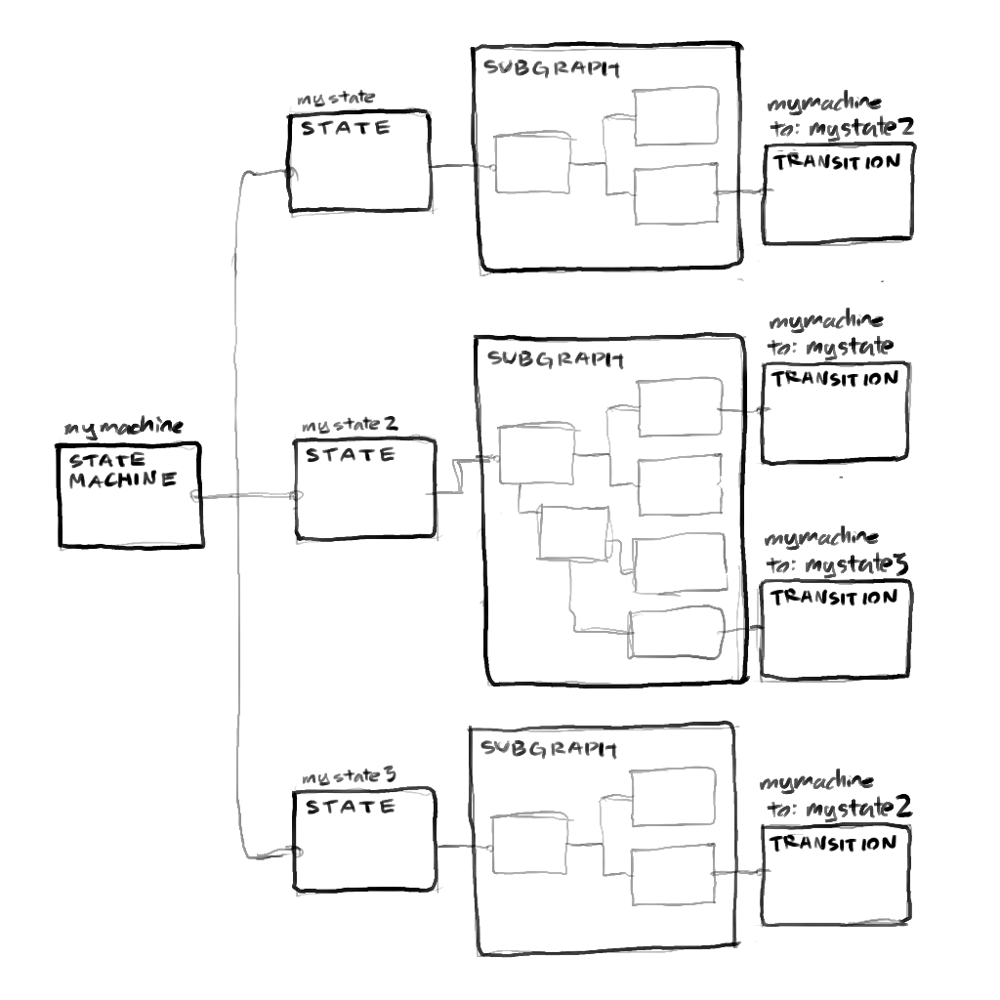
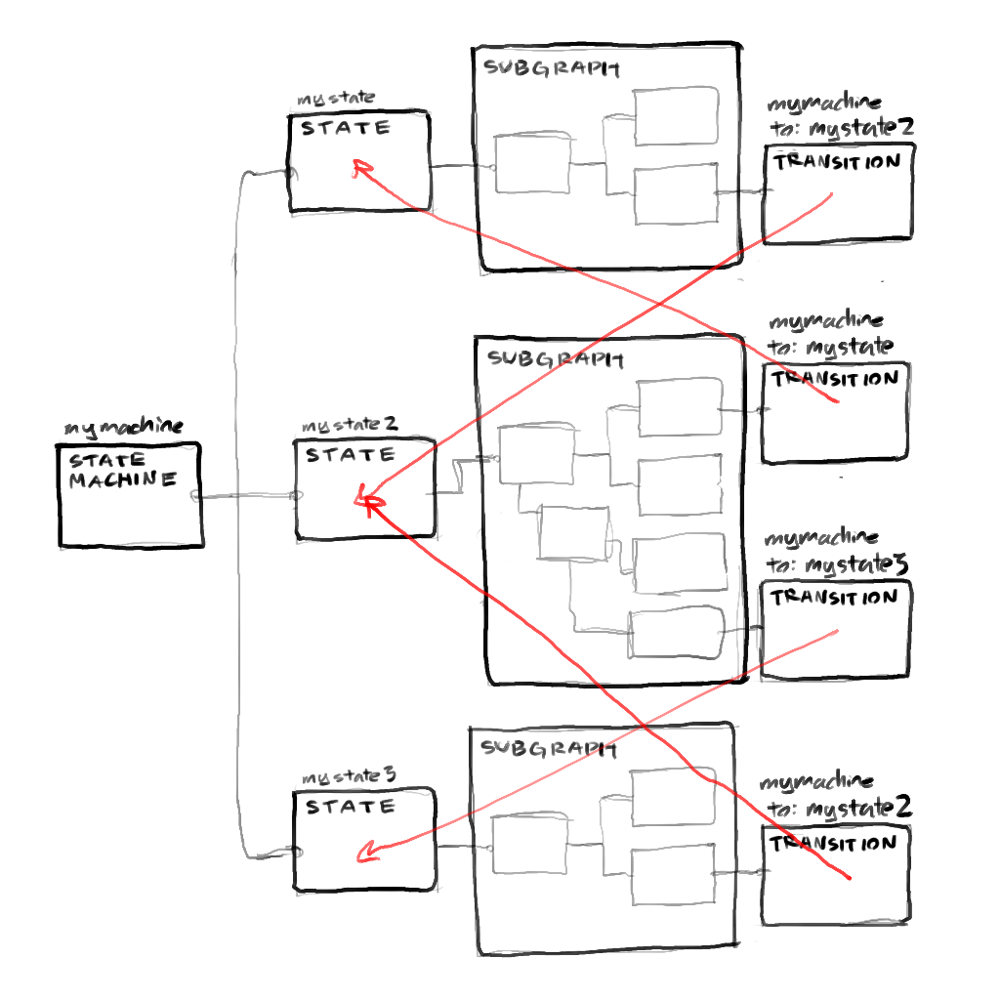

# Fractural State Script 📜

Fratural State Script is a Godot 3.x C# addon that adds state scripts into Godot. This is inspired by Overwatch's implementation.

See Dan Reed's GDC talk on [Networking Scripted Weapons and Abilities in Overwatch](https://www.youtube.com/watch?v=5jP0z7Atww4&t=553s).

## Dependencies

- GodotRollbackNetcode - Snopek games' rollback netcode addon in GDScript
- GodotRollbackNetcodeMono - C# wrapper for Snpoek games' addon
- FracturalInject - Dependency injection plugin for Godot
- FracturalCommmons - Common utility classes for Godot game + plugin development

## Architecture

Gameplay logic is written in StateScript, a visual node-based scripting langauge. When a StateScript graph is ran, the logic is ran.

A StateScript graph is stored as a node in the scene, and StateScript nodes are stored as children of the StateScript. A StateScript graph itself is also a StateScript node, meaning StateScripts can be used within other StateScripts, creating a tree like structure of nodes. Since StateScripts are nodes, they should be saved as PackedScenes in Godot. More complicated states can be built using the PackedScenes of existing StateScripts.

Each node is implemented in C# by the user, and should represent simple behaviours, such as waiting, shooting, etc. StateScript provides lifetime guarantees. This means each node cleans up after itself, including when the state is rolled back.

State scripts alsxo ideally should avoid loops for easier clarity. Instead, looping should be done through nodes that fire repeatedly and then end.

Types of Nodes

- Entry - An entry into the StateScript. A StateScript can have multiple entry points. Entry points can also be named, and will create a separate input slot in the StateScript when it's used as a subgraph.
- State - Node that does something over time, such as waiting, etc.
- Action - Node that does something immediately.
- Exit - A node that exits the StateScript. This node will become an output point if this
  StateScript is used as a subgraph of another StateScript.

### Node Variables

State and Action nodes have settings that are configured by Node Variables, or NodeVars for short. NodeVars are Godot nodes that represent a variable. For example there are boolean, float, integer, and string NodeVars. These NodeVars implement `FracturalInject`'s Dependency under the hood, so they can both represent some initial value or point to another NodeVar.

A user can declare a NodeVar for a StateScript by creating a new NodeVar node as a child of a `Node` named `Dependencies` underneath the StateScript node.

There are four types of NodeVars

- Get/Set - The NodeVar can be read and written to when accessed outside of outside of the StateScript
- Get - The NodeVar can only be read from when accessed outside of the StateScript
- Set - The NodeVar can only be written to when accessed outside of the StateScript.
- Private - The NodeVar can only be accessed in the StateScript it was declared in. This may be used to keep track of internal variables that should not be exposed when the StateScript is used.

#### Expression NodeVar

Expression NodeVars are a unique type of Get NodeVar that lets the user input an expression, along with a list of NodeVars that are used as variables within the expression. Every time something attempts to "fetch" this Expression NodeVar, the expression is evaluated and the result is returned.

## Example

Here's an example scene layout for a hypothetical `Movement` StateScript. Note that this Movement StateScript could be used as a subgraph within another StateScript. In fact, this movement code uses another `AddForce` StateScript as a subgraph.

Note that this is only a view of the SceneTree for the Movement StateScript PackedScene. The actual wiring up of the nodes happens in the StateScript graph.

```
NODE NAME:            NODE TYPE:          NODE VARS:

Movement           -> StateScript
|                     |- Target        -> Set     '.
|                     |- SprintSpeed   -> Set      |
|                     |- JumpPower     -> Set      |- Node Variables
|                     |- Drag          -> Set      |
|                     |- Velocity      -> Get      |
|                     '- InternalVar   -> Private .'
|- AddForce        -> StateScript                 '.
| |                   '- ForceAmount   -> Set      | - Subgraph
| '- WaitState     -> State                       .'
|- SetVarAction    -> Action
'- SetVarAction2   -> Action
```

## State Machines

You can use a StateScript itself as a state machine. Each "state" in the state machine can be defined as a subgraph in a StateScript. But since it's really easy for complicated state machines to experience [state explosion](https://statecharts.dev/state-machine-state-explosion.html), we can instead use a tree-like structure for state machines, similar to how the [Beehave addon](https://statecharts.dev/state-machine-state-explosion.html) works.



`StateMachineState` nodes reprsent individual states within the state machine. These nodes must have a unique name to distinguish themselves amongst other states within the same state machine. They also have various lifecycle outputs, such as

- OnStart - Runs when the state becomes active
- OnTick - Runs on every tick when this state is active
- OnEnd - Runs when the state machine transitions out of this state

Thesse outputs can be linked to subgraphs that represent behaviours.

`StateMachine` nodes represent state machines. A `StateMachineState` node have multiple `StateMachineState` node branching out of it, and at any given point it can only have one active `StateMachineState` node. The active state node will have it's `OnTick` input fired.

`StateMachineTransition` transitions a `StateMachine` to a different state. These transition nodes appear at the end of the subgraphs of a `StateMachineState`, and mark the end of a state.



Here's the same state machine but with transitions indicated by arrows marked in red. If we had not used as tree-like structure, we would have gotten the sphagetti mess of transitions connecting states, looping back and forth and ultimately making it harder to trace.

## TODO

- [ ] Finish the core StateScript functionality
- [ ] Add rollback to StateScript
- [x] Maybe make a single NodeVarContainer node per StateScript and have that store all the NodeVars as data within the NodeVarContainer.
  - Pros
    - This would reduce the amount of nodes per scene, potentially leading to performance gains?
  - Cons
    - Dependencies aren't as "visible" on a node, since you'd have to click on the NodeVarContainer to see the nodes.
    - Requires more work to make a custom inspector for the NodeVarContainer as well as for scripts that need to use NodeVars. You can no longer just export a NodePath to received a NodeVar — you must have some sort of custom solution implemented instead.
      - How do you handle NodeVar renaming if it's not stored as a Node? Godot normally preserves NodePath references to a Node if the Node is renamed. But if we have our own NodeVarContainer, we'd have to make sure renames propagate.
      - We'd have to access dependencies of the StateScript PackedScene, and then try to rename the uses of the variable there — might get complicated.
  - WIP
- [ ] Make the NodeVars dictionary injectable by FracturalInject
  - Maybe even rework Dependencies to use the NodeVar container.
